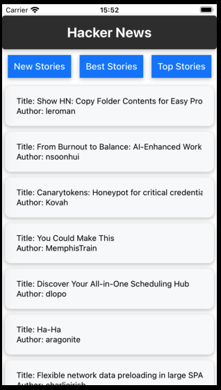
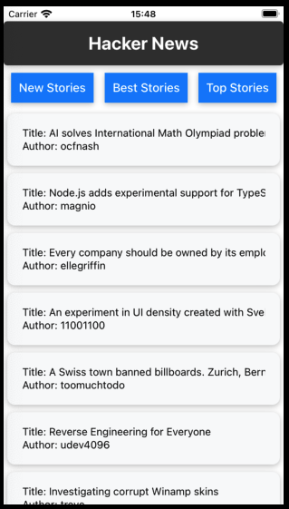
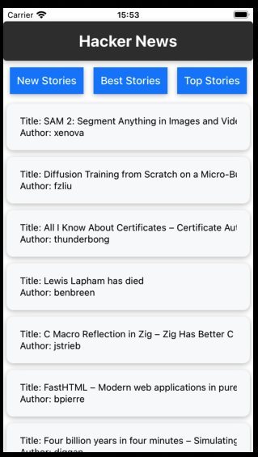
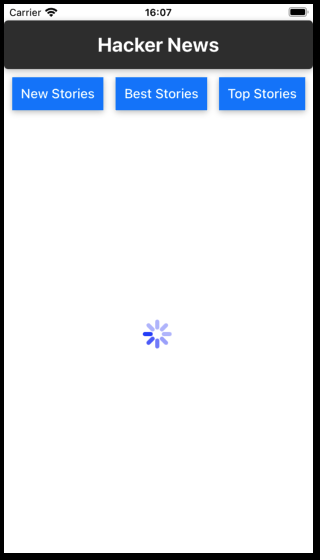

# Introduction

## Hacker News

### Description:

This is an application for reading news from Hackers.

Api providers: [Hacker API](https://github.com/HackerNews/API?tab=readme-ov-file#new-top-and-best-stories)

### All features:

- **New Stories**: See all new stories from Hackers. When scrolling down the story list will be automatically appear more and more.

- **Top Stories**: See all top stories from Hackers. When scrolling down the story list will be automatically appear more and more.

- **Best Stories**: See all best stories from Hackers. When scrolling down the story list will be automatically appear more and more.

- **Story Information**: When we select the article from the story list. The story information will be displayed.

- **Comments of the story**: In the story information screen, in the bottom, the comments of the story will be displayed.

- **Spinner**: When fetching apis from hacker. The spinner will be shown.

### Demo:

**New stories screen:**

**Best stories screen:**

**Top stories screen:**

**Spinner:**

**Story Information:**

